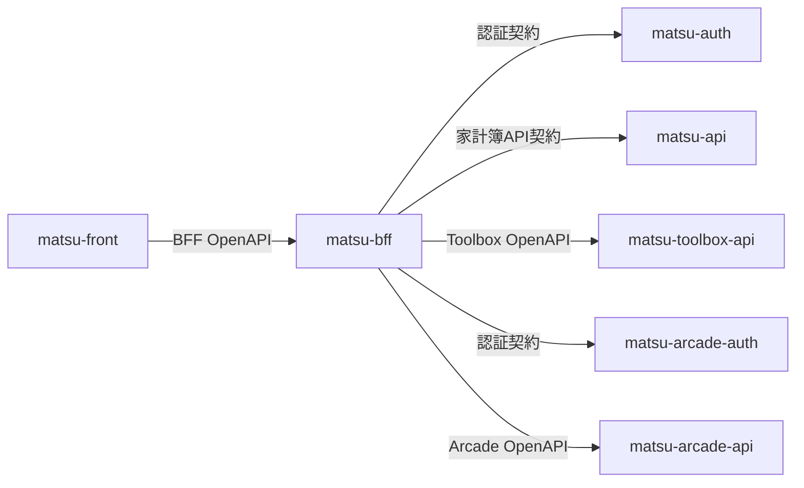

# API契約

## 目的

`matsu` のAPI契約は、サービスの独立性を保つため、APIを提供するリポジトリが所有します。この資料では、サービス間の契約境界、正本、変更時に同期する範囲を定義します。

個々のendpoint、request、response、status codeを網羅することは目的としません。生成済みOpenAPIがあるサービスではOpenAPIをschemaの正本とし、同じ内容をこの資料へ転記しません。

## 契約境界

- Frontendが依存するアプリケーションAPI契約はBFFだけが所有する
- BFFは各上流APIの契約をFrontend向け契約へ明示的に変換する
- 上流APIのrouteやresponseをBFFから透過公開しない
- Resource APIとAuth Serverは互いのコードやデータベースに依存せず、HTTP契約だけを共有する
- 認証tokenのissuer、audience、署名検証条件はAPI schemaとは別に、[認証・セッション構成](authentication.md)を横断契約とする

## 契約の正本

| 契約 | 提供者 | schemaの正本 | 主な利用者 |
| --- | --- | --- | --- |
| Browser向けアプリケーションAPI | `matsu-bff` | BFFのroute・schemaから生成したOpenAPI | `matsu-front` |
| 家計簿Resource API | `matsu-api` | 実装と自動test | `matsu-bff` |
| Toolbox Resource API | `matsu-toolbox-api` | route・schemaから生成したOpenAPI | `matsu-bff` |
| Arcade Resource API | `matsu-arcade-api` | route・schemaから生成したOpenAPI | `matsu-bff` |
| 家計簿・Toolbox認証API | `matsu-auth` | 実装 | `matsu-bff` |
| Arcade認証API | `matsu-arcade-auth` | 実装と自動test | `matsu-bff` |

生成済みOpenAPIは各提供リポジトリの `openapi/openapi.json` に置きます。FrontendはBFF OpenAPIから型を生成します。BFFはToolbox APIまたはArcade APIのOpenAPIをそのままFrontendへ公開せず、自身が所有するrouteとschemaでFrontend向け契約を定義します。

OpenAPIがないサービスでは、表に示した実装と、存在する場合は自動testがendpoint単位の正本です。現時点の `matsu-auth` には自動testがないため、実装を正本とします。この設計資料には、利用者が連携に必要とする認証方式、責務、依存方向だけを記載します。

## 各境界の責務

### FrontendとBFF

- BFFが公開するroute、request、response、error schemaをBFF OpenAPIで共有する
- FrontendはBFF OpenAPIから生成した型を利用し、上流API固有のschemaへ直接依存しない
- Browser sessionはCookieで表現し、tokenをFrontend向け契約へ含めない

### BFFとResource API

- Resource APIが自身のdomain契約と認証要件を所有する
- BFFは許可したrouteだけを明示的に呼び出し、対応するresourceのtokenだけを付与する
- BFFは上流の成功responseをFrontend向けschemaで検証し、上流固有のerrorや内部URLをそのまま公開しない
- Resource APIはBFF sessionや画面都合を認識しない

### BFFとAuth Server

- Auth Serverが資格情報の検証、token発行、refresh、revokeの契約を所有する
- BFFがBrowser向けの認証開始、callback、session保存、resource接続状態の契約を所有する
- Auth Serverが返すaccess tokenとrefresh tokenをFrontend向けresponseへ含めない
- 2つのAuth realmの契約を混在させない

## 契約変更の原則

1. API提供者のリポジトリで実装、schema、自動testを変更する。
2. OpenAPIを持つサービスでは生成済みOpenAPIを更新し、生成元との差分がないことを確認する。
3. 利用者のリポジトリでmapping、型、契約testを更新する。
4. サービス境界、認証方式、データ所有、利用者が知る振る舞いが変わる場合だけ、この設計資料を更新する。

互換性を壊す変更は、提供者と利用者を別々に安全な状態へ移行できる順序で行います。サービス間で内部型、ソースコード、データベースschemaを共有することによって契約を同期しません。

## この資料で扱わない内容

- endpoint一覧やschema全文
- request・responseのサンプル網羅
- クラス、関数、middlewareなどの実装詳細
- OpenAPI生成コマンド、起動手順、ローカル接続先
- CIや静的解析の実行方法
