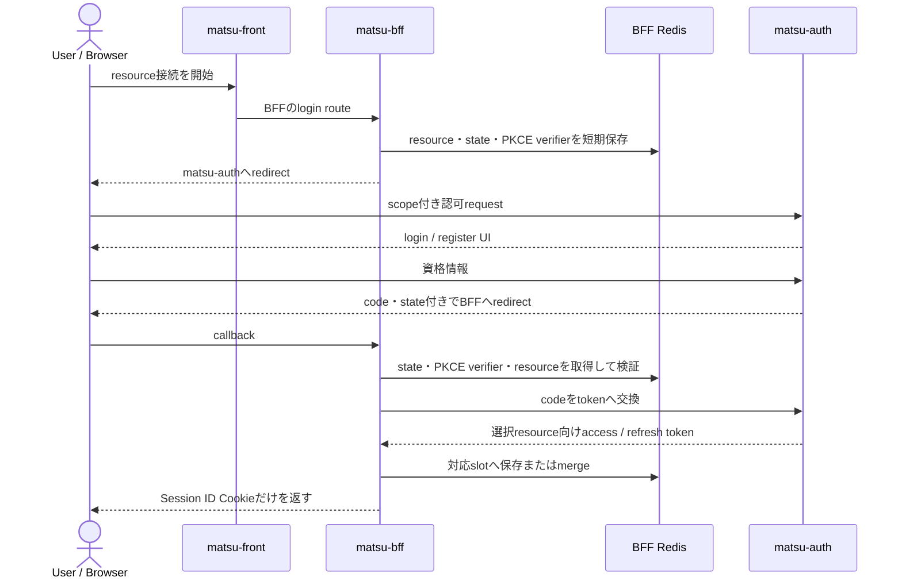
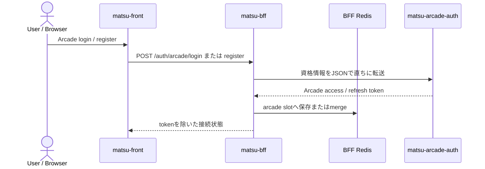

# 認証・セッション構成

## 基本方針

`matsu` は、Browser session、2つのAuth realm、3つのResource API認証を分けて扱います。

| 対象 | 現在の方式 |
| --- | --- |
| BrowserとBFF | 推測困難なsession IDを持つ `HttpOnly` Cookie |
| 家計簿・Toolbox接続 | `matsu-auth` のAuthorization Code + PKCE |
| 家計簿の後方互換login/register | BFFが `matsu-auth` のJSON APIを仲介 |
| Arcade接続 | BFFが `matsu-arcade-auth` のJSON login/registerを仲介 |
| BFFとResource API | resource別のRS256 JWT access token |
| Resource APIの署名検証 | 対応するAuth Serverが公開するJWKS |

ブラウザが保持する認証情報はBFFのsession IDだけです。access tokenとrefresh tokenはBFF専用Redisに保存し、JSON responseやFrontend JavaScriptへ返しません。

## BFF session

BFFはRedis上のversion 2 sessionに、resourceごとのtoken slotを保存します。

```text
session (version: 2)
├── matsuApi
│   ├── accessToken
│   ├── refreshToken
│   └── expiresAt
├── toolbox
│   ├── accessToken
│   ├── refreshToken
│   └── expiresAt
└── arcade
    ├── accessToken
    ├── refreshToken
    └── expiresAt
```

- 各slotはaccess token、refresh token、有効期限を独立して持つ
- Redisから読み出したsessionはschema検証し、不正な値は無効化する
- 旧単一token sessionは `matsuApi` slotへ移行する
- 既存sessionへ別resourceを接続するときは他slotを保持したままmergeする
- `GET /auth/session` はtokenを含めず、`matsuApi`、`toolbox`、`arcade` の接続状態だけを返す

## matsu-auth realm

`matsu-auth` は `matsu-api` と `matsu-toolbox-api` の2つのResource APIを担当します。この簡易Authではresource名、OAuth scope、JWT audienceを同じ文字列として扱います。

| BFF上のresource | OAuth scope / JWT audience | BFFの開始route | 保存先slot |
| --- | --- | --- | --- |
| 家計簿 | `matsu-api` | `GET /auth/login` | `matsuApi` |
| Toolbox | `matsu-toolbox-api` | `GET /auth/toolbox/login` | `toolbox` |



BFFはstateとPKCE verifierを通常sessionとは別の短命データとしてRedisへ保存します。`matsu-auth` はallowlist外のscope/audienceを拒否し、refresh tokenにも選択したaudienceを保持するため、更新後に別resource用tokenへ変わりません。

後方互換の `POST /auth/login` と `POST /auth/register` もBFFが仲介し、`matsu-auth` の既定audienceである `matsu-api` のtokenを `matsuApi` slotへ保存します。資格情報やtokenをBrowserへ保持させません。

## matsu-arcade-auth realm

`matsu-arcade-auth` は `matsu-arcade-api` 専用の別realmです。現在実装しているのはemail/passwordのJSON register/login、refresh token rotation、revoke、JWKS公開であり、OAuth/OIDCやBrowser向けlogin UIは実装していません。



BFFはArcadeの資格情報を永続化せず、ログへ出さずにArcade Authへ転送します。Arcade Authが返すtokenは `arcade` slotへ保存し、Browser responseには含めません。

## Resource APIの信頼関係

| Resource API | 信頼するissuer | 必須audience | JWKS提供者 |
| --- | --- | --- | --- |
| `matsu-api` | `http://localhost:18081` | `matsu-api` | `matsu-auth` |
| `matsu-toolbox-api` | `http://localhost:18081` | `matsu-toolbox-api` | `matsu-auth` |
| `matsu-arcade-api` | `http://localhost:18084` | `matsu-arcade-api` | `matsu-arcade-auth` |

各Resource APIは対応AuthのJWKSを取得・cacheし、少なくともRS256署名、issuer、audience、有効期限、access token用途、主体を検証します。Resource APIはAuthの秘密鍵を持たず、Auth ServerはResource APIのdomain DBを参照しません。

2つのAuth realmは、ユーザーDB、issuer、署名鍵、refresh tokenを共有しません。`matsu-auth` のtokenをArcade APIへ、Arcade Authのtokenを家計簿・Toolbox APIへ送っても、issuerまたはaudienceが一致せず拒否されます。

## 認証済みAPI呼び出しとtoken更新

1. Browserはsession Cookie付きでBFFの明示routeを呼ぶ。
2. BFFはrouteに対応するtoken slotをRedis sessionから選ぶ。
3. slotがなければ上流を呼ばず `401` を返す。
4. BFFは選んだaccess tokenだけをBearer JWTとして対応Resource APIへ送る。
5. Resource APIは対応AuthのJWKSとissuer/audienceでJWTを検証する。
6. 上流が `401` の場合、BFFは対象slotだけを更新し、同じrequestを1回だけ再試行する。
7. 更新または再試行が失敗した場合、BFFは対象slotだけを削除する。全slotが空になった場合だけsession全体とCookieを削除する。

`matsuApi` と `toolbox` のrefreshは `matsu-auth` のOAuth token endpoint、`arcade` のrefreshは `matsu-arcade-auth` の `/auth/refresh` を使います。1つのresourceの更新失敗は他resourceのslotとrouteへ波及させません。明示的な `POST /auth/refresh` は後方互換の家計簿用であり、`matsuApi` slotを更新します。

## logoutとresource disconnect

| 操作 | 現在の動作 |
| --- | --- |
| `POST /auth/logout` | RedisのBrowser session全体とCookieを削除し、3つのslotをすべて切断する |
| `POST /auth/arcade/disconnect` | Arcade Authへのrevokeを可能な範囲で試み、`arcade` slotだけを削除する |

Arcade revokeに失敗しても、BFFは他resourceのslotを削除しません。現在、Toolboxや家計簿向けの汎用resource disconnect endpointは実装していません。

## セキュリティ上の責務

| コンポーネント | 責務 |
| --- | --- |
| `matsu-front` | BFFで認証開始、resource接続状態の確認、認証切れ時の画面遷移 |
| `matsu-bff` | Cookie属性、session、OAuth state・PKCE、resource別token保管・更新・選択 |
| `matsu-auth` | 家計簿・Toolboxの資格情報検証、OAuth認可、resource別token発行・署名、JWKS |
| `matsu-arcade-auth` | Arcade資格情報検証、Arcade token発行・rotation・revoke・署名、JWKS |
| 3つのResource API | 対応realmのJWT検証と、認証済み主体に対するdomain処理 |

BFFのsession Cookieは `HttpOnly`、`SameSite=Lax` を基本とし、HTTPS環境では `Secure` を有効にします。Frontendはaccess tokenやrefresh tokenを `localStorage` などへ保存しません。

サービス全体の通信・データ所有関係は[システム全体構成](system-overview.md)、認証APIを含むサービス間契約の正本は[API契約](api-contracts.md)を参照してください。
