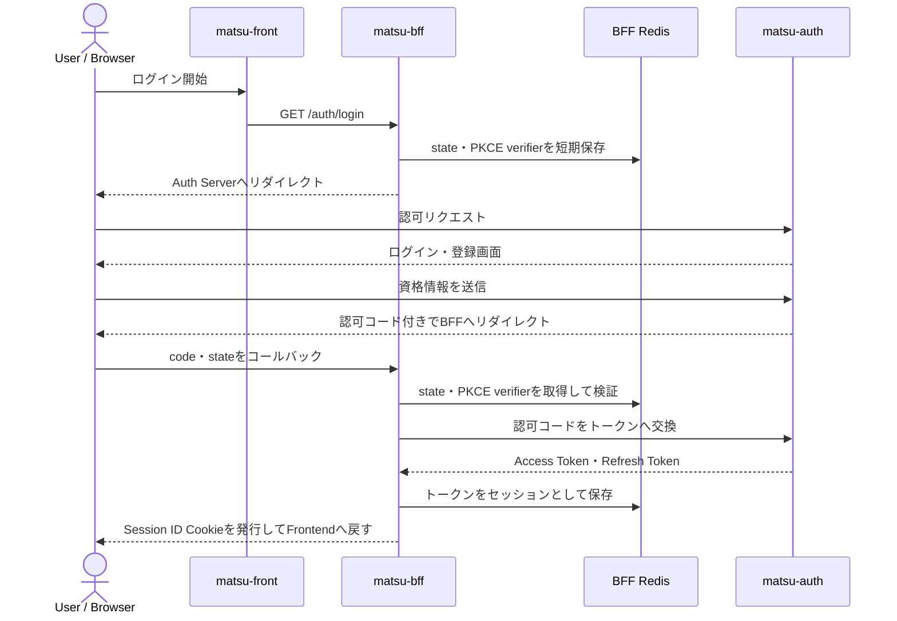
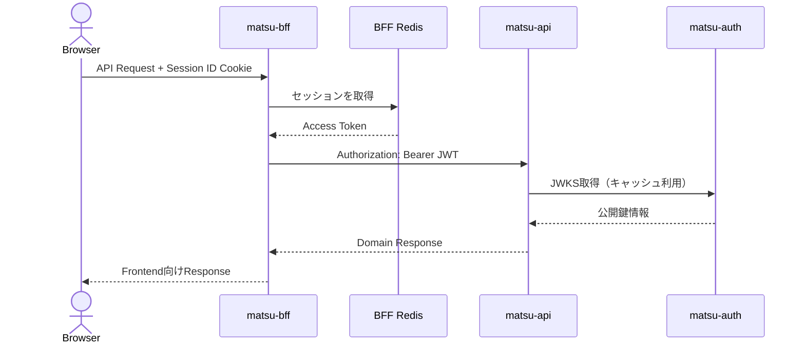

# 認証・セッション構成

## 基本方針

`matsu` の認証は、ブラウザセッション、ログインフロー、API認証を分けて扱います。

| 対象 | 方式 |
| --- | --- |
| ブラウザとBFF | 推測困難なセッションIDを持つCookie |
| ブラウザログイン | Authorization Code + PKCE |
| BFFとAuth Server | Confidential OAuth Client |
| BFFとAPI | RS256で署名されたJWTアクセストークン |
| APIの署名検証 | Auth Serverが公開するJWKS |

「認証方式はJWT」という表現だけでは、JWTをブラウザが保持しているようにも解釈できます。実際には、ブラウザが保持するのはBFFのセッションIDだけであり、JWTはBFFからAPIへの認証に使用します。

## Auth Serverの位置づけ

Auth Serverは、`matsu` に必要な認証機能をまとめた簡易的な認証プラットフォームです。

- ログイン・ユーザー登録画面を提供する
- ユーザーの資格情報を検証する
- OAuth認可リクエストを受け付ける
- 認可コードを発行する
- アクセストークンとリフレッシュトークンを発行する
- JWT検証用のJWKSとOAuthメタデータを公開する

ログインフォームはFrontendではなくAuth Serverがサーバーサイドレンダリングで提供します。これにより、認証UIと認証処理を同じサービス境界に置きます。

現在は`matsu-bff`をOAuthクライアント、`matsu-api`をアクセストークンの対象として構成した、`matsu`向けの認証基盤です。汎用的な外部IdPや完全なOpenID Connect Providerとして位置づけるものではありません。

## ログインフロー

### 設計上の要点

- BFFは`state`を用いて認可レスポンスの対応関係を検証する
- BFFはPKCE verifierを短期間だけRedisに保存する
- 認可コードとトークンの交換はBFFからAuth Serverへサーバー間通信で行う
- ブラウザにはアクセストークンとリフレッシュトークンを返さない
- ブラウザにはBFFセッションを識別するCookieだけを返す

## 認証済みAPI呼び出し

APIはセッションIDを解釈しません。JWTの署名、issuer、audienceなどを検証し、認証されたリクエストとして処理します。

## トークン更新

アクセストークンの期限切れなどでAPIが`401`を返した場合、FrontendはBFFのリフレッシュ処理を呼び出します。

1. BFFはセッションに保存されたリフレッシュトークンを取得する。
2. BFFはAuth Serverのトークンエンドポイントでトークンを更新する。
3. Auth Serverはリフレッシュトークンをローテーションする。
4. BFFはRedis上のセッションを新しいトークンで更新する。
5. 更新に失敗した場合、BFFはセッションとCookieを無効化し、Frontendはログインフローへ戻る。

## ログアウト

ログアウト時は、BFFがRedis上のセッションを削除し、ブラウザのセッションCookieを削除します。ブラウザ側でトークンを削除する処理はありません。

## セキュリティ上の責務

| コンポーネント | 責務 |
| --- | --- |
| Frontend | 認証開始、セッション状態の確認、認証切れ時の画面遷移 |
| BFF | Cookie属性、セッション、OAuth state、PKCE、トークン保管・更新 |
| Auth Server | 資格情報検証、認可コード、トークン発行・署名、公開鍵提供 |
| API | JWT検証、認証済みユーザーとしてのAPI処理 |

BFFのセッションCookieは`HttpOnly`、`SameSite=Lax`を基本とします。HTTPS環境では`Secure`を有効にします。Frontendはアクセストークンやリフレッシュトークンを`localStorage`などへ保存しません。
