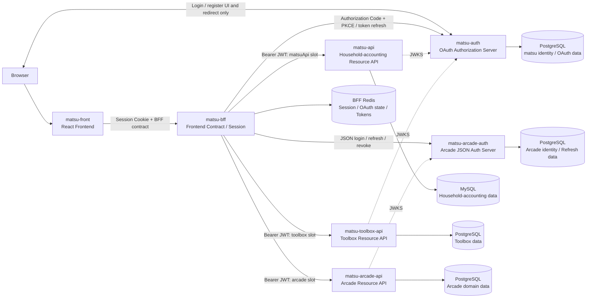

# システム全体構成

## 目的

`matsu` は、ブラウザ向けFrontend、Frontend専用BFF、3つのResource API、2つのAuth Serverを分離した7アプリ構成です。

ブラウザへJWTやrefresh tokenを公開せず、認証realmと各ドメインのデータを独立させながら、FrontendにはBFFが所有する一つの明示的なAPI境界を提供します。

## 構成

図中のAuth Serverへのブラウザ通信は、`matsu-auth` が提供するログイン・登録画面とOAuthリダイレクトに限ります。FrontendのアプリケーションAPI呼び出しと、Arcade資格情報を送るJSON認証呼び出しは、どちらもBFFを経由します。

## 7アプリの責務

| アプリ | 主な責務 | 所有する状態 |
| --- | --- | --- |
| `matsu-front` | 画面表示、ユーザー操作、BFF APIの利用 | 画面の一時状態。tokenは保持しない |
| `matsu-bff` | ブラウザセッション、認証仲介、3 APIへのroute dispatch、Frontend向け契約 | 専用Redis上のresource別tokenとセッション |
| `matsu-auth` | 家計簿・Toolbox realmのユーザー認証、OAuth認可、JWT・JWKS | 専用PostgreSQL上のユーザー・OAuth・refresh tokenデータ |
| `matsu-api` | 家計簿ドメイン処理 | 専用MySQL上の家計簿データ |
| `matsu-toolbox-api` | メモ、ブックマーク、テキスト検査 | 専用PostgreSQL上のToolboxデータ |
| `matsu-arcade-auth` | Arcade realmのJSON login/register/refresh/revoke、JWT・JWKS | 専用PostgreSQL上のユーザー・refresh tokenデータ |
| `matsu-arcade-api` | プレイヤープロフィール、ゲーム、スコア、ランキング | 専用PostgreSQL上のArcadeデータ |

## 通信とroute dispatch

### ブラウザ向け正式経路

Frontendは `VITE_BFF_BASE_URL` で指定したBFFだけをアプリケーションAPIとして呼び出します。各Backend APIはResource Serverとして単体利用でき、ネットワーク上で直接到達可能な構成でも、ブラウザ向けの正式な経路と契約はBFFです。

BFFは汎用reverse proxyではありません。Frontend向けroute、request、成功response、errorを明示的に定義し、route namespaceごとに上流とtoken slotを選びます。

| BFFのroute | 上流 | token slot |
| --- | --- | --- |
| `/api/expenses/*`、`/api/payment-methods`、`/api/categories` | `matsu-api` | `matsuApi` |
| `/api/toolbox/*` | `matsu-toolbox-api` | `toolbox` |
| `/api/arcade/*` | `matsu-arcade-api` | `arcade` |

- Frontendから3つのResource APIへの直接呼び出しは行わない
- 3つのResource APIは互いを直接呼び出さない
- BFFはBrowserから受け取ったAuthorization header、Cookie、上流URLを上流やresponseへ透過しない
- 各routeには対応するresourceのBearer JWTだけを付与する
- BFFは上流の成功responseをFrontend向けschemaで検証する

### 障害分離

BFFは3つの上流をURL設定で独立に選択し、各上流呼び出しにtimeoutを設けます。1つの上流の停止、timeout、非JSON response、schema不一致はそのrouteの安全なBFF errorへ変換し、他の上流routeを停止させません。

上流が `401` を返した場合も、BFFは対象resourceのtokenだけを1回更新して再試行します。更新または再試行に失敗した場合は対象slotだけを切断し、無関係なtoken slotとrouteを維持します。

## 2つのAuth realmと3つのaudience

| Resource API | JWT issuer | audience | JWKSの所有者 |
| --- | --- | --- | --- |
| `matsu-api` | `http://localhost:18081` | `matsu-api` | `matsu-auth` |
| `matsu-toolbox-api` | `http://localhost:18081` | `matsu-toolbox-api` | `matsu-auth` |
| `matsu-arcade-api` | `http://localhost:18084` | `matsu-arcade-api` | `matsu-arcade-auth` |

`matsu-auth` ではresource名、OAuth scope、JWT audienceに同じ値を使い、`matsu-api` と `matsu-toolbox-api` をallowlistで分離します。`matsu-arcade-auth` は `matsu-arcade-api` 専用であり、既存realmとユーザー、issuer、署名鍵、refresh tokenを共有しません。

各Resource APIはRS256署名、issuer、audience、有効期限、access token用途などを検証します。別resource向け、または別realm発行のtokenは受け入れません。

## データと状態の所有者

状態は、ブラウザ一時状態、BFFセッション、Authデータ、Resourceドメインデータの4論理区分です。実ストアはサービス単位の6つに分かれ、所有者は次のとおり一意です。

| 実ストア | 一意の所有者 | 内容 | 共有しない相手 |
| --- | --- | --- | --- |
| BFF Redis | `matsu-bff` | Browser session、resource別token、OAuth state・PKCE verifier | 全Auth Server、全Resource API |
| matsu Auth PostgreSQL | `matsu-auth` | ユーザー、OAuth認可情報、audience付きrefresh token | Arcade Auth、全domain DB |
| 家計簿MySQL | `matsu-api` | 支出、支払方法、カテゴリなど | Auth DB、他Resource API |
| Toolbox PostgreSQL | `matsu-toolbox-api` | ユーザー別メモ、ブックマーク | Auth DB、他Resource API |
| Arcade Auth PostgreSQL | `matsu-arcade-auth` | Arcadeユーザー、hash化したrefresh token | matsu Auth、Arcade domain DB |
| Arcade PostgreSQL | `matsu-arcade-api` | プロフィール、ゲーム、スコア | Auth DB、他Resource API |

Auth DBとdomain DBは共有しません。DB接続、volume、migrationも各サービスが所有し、サービス間結合には使いません。テスト用DBも各リポジトリ内の専用・一時ストアであり、開発用DBや他サービスのDBを参照しません。

## API契約

FrontendとBFFの間は、BFFが生成するOpenAPIを契約の基準とします。

- BFFは3つの上流に対応する明示的なFrontend向けrouteとschemaを持つ
- BFFのrouteとschemaからOpenAPIを生成する
- FrontendはそのOpenAPIからTypeScript型を生成する
- BFFは上流OpenAPIを透過公開せず、上流の成功responseを自身の契約で検証する

これにより、FrontendはBackend API内部の仕様ではなく、BFFが公開するブラウザ向け契約に依存します。

## 設計上の境界

- Frontendはアクセストークン、refresh token、クライアントシークレットを扱わない
- BFFはFrontend契約とセッションを所有するが、各ドメインデータや認証資格情報を永続化しない
- Resource APIはBrowser session、ログインUI、token発行を担当しない
- Auth Serverはdomain処理を担当せず、Resource APIのDBへ接続しない
- Backend API同士は直接呼び合わない
- DBとRedisはサービス間で共有しない

認証とresource別sessionの詳細は[認証・セッション構成](authentication.md)、各サービスの技術的な位置づけは[個別構成](../../README.md#個別構成)を参照してください。

## この資料で扱わない内容

- 各サービスのクラス、関数、ディレクトリ単位の詳細設計
- 個々のAPI endpointの完全な仕様
- ローカル環境のURL・port・起動手順
- 本番インフラの構成
