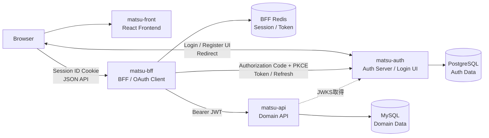

# システム全体構成

## 目的

`matsu` は、ブラウザ向けFrontend、Backend for Frontend（BFF）、家計簿API、認証サーバーを分離した構成です。

この分離により、ブラウザへ認証トークンを公開せず、認証と家計簿ドメインを独立させながら、Frontendから利用しやすいAPI境界を提供します。

## 構成

## コンポーネントの責務

| コンポーネント | 主な責務 | 主な永続データ |
| --- | --- | --- |
| `matsu-front` | 画面表示、ユーザー操作、BFF APIの利用 | 認証トークンを保持しない |
| `matsu-bff` | ブラウザセッション、OAuthクライアント、Frontend向けAPI契約、API呼び出し | Redis上のセッション、アクセストークン、リフレッシュトークン |
| `matsu-api` | 家計簿ドメインの処理とデータ提供 | MySQL上の家計簿データ |
| `matsu-auth` | ログイン・登録画面、資格情報の検証、認可コードとトークンの発行、公開鍵の提供 | PostgreSQL上の認証データ |

## 通信の基本方針

### 通常のAPI利用

1. FrontendはBFFのAPIだけを呼び出す。
2. ブラウザはBFFが発行したセッションIDをCookieで送信する。
3. BFFはRedisからセッションに対応するアクセストークンを取得する。
4. BFFはアクセストークンをBearer JWTとしてAPIへ送信する。
5. APIはAuth Serverが公開するJWKSを利用してJWTを検証する。

FrontendはAPIやAuth ServerのJSON APIを直接利用しません。BFFをブラウザとのセキュリティ境界にすることで、アクセストークンとリフレッシュトークンをブラウザから隠します。

### ログイン

ログイン時のみ、ブラウザはBFFからAuth Serverへリダイレクトされます。ログイン・ユーザー登録画面はAuth Serverが提供し、認証完了後はBFFのコールバックへ戻ります。

詳細は[認証・セッション構成](authentication.md)を参照してください。

## データと状態の所有者

| 情報 | 所有者 | 補足 |
| --- | --- | --- |
| 画面の一時状態 | Frontend | 画面表示に必要なクライアント状態 |
| ブラウザのセッションID | BFF | `HttpOnly` Cookieとしてブラウザに保存 |
| アクセストークン | BFF | Redisに保存し、ブラウザには渡さない |
| リフレッシュトークン | BFF | Redisに保存し、ブラウザには渡さない |
| ユーザー・認証情報 | Auth Server | 認証ドメインとして管理 |
| 家計簿データ | API | 家計簿ドメインとして管理 |

## API契約

FrontendとBFFの間は、BFFが生成するOpenAPIを契約の基準とします。

- BFFは明示的なFrontend向けルートとスキーマを持つ
- BFFのルートとスキーマからOpenAPIを生成する
- FrontendはOpenAPIからTypeScript型を生成する
- BFFはAPIの成功レスポンスも契約に沿って検証する

これにより、FrontendはAPI内部の仕様ではなく、BFFが公開するブラウザ向け契約に依存します。

## 設計上の境界

- Frontendはアクセストークン、リフレッシュトークン、クライアントシークレットを扱わない
- BFFは家計簿データの永続化や認証資格情報の検証を担当しない
- APIはブラウザセッションやログイン画面を担当しない
- Auth Serverは家計簿ドメインの認可済みAPI処理を担当しない
- BFF専用Redisを他サービスの汎用データストアとして共有しない

## この資料で扱わない内容

- 各サービスのクラス、関数、ディレクトリ単位の詳細設計
- 個々のAPIエンドポイントの完全な仕様
- ローカル環境の起動手順
- 本番インフラの構成

各サービスの技術的な位置づけは、[個別構成](../../README.md#個別構成)を参照してください。
